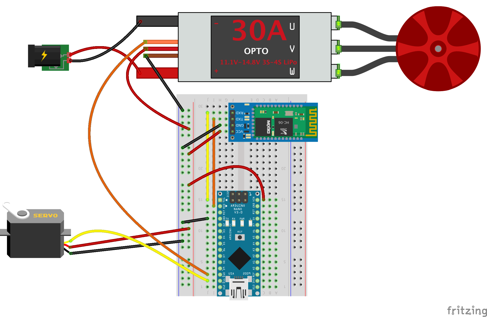

# Tips for Building The Motor-powered Nodeboat!

This build does require soldering, so ask for help if you need it.

In order to power the boat, the battery will connect directly to the Electronic Speed Controller (ESC) and share the power from the ESC to the breadboard. See the hookup diagram below. The battery has an XT60 connector that needs a matching connector soldered onto the ESC's red and black wires. Check out the sides of the XT60 for a plus (+) and a minus (-) sign with the red wire (power) lining up with the plus sign and the black wire (ground) lining up with the minus sign. Once the battery is hooked up to the ESC, you can use the power switch on the ESC to test the connection.

The following is an example hookup for using the ESC:

Pin hookup:

- RXD on HC-06 <-> TX1 on Nano
- TXD on HC-06 <-> RX0 on Nano
- Orange wire on ESC <-> D10 on Nano
- Every black wire goes to the ground (GND) rail
- Every red wire, VCC on HC-06, and VIN on Nano goes to the power rail

Adding the servo for steering is as simple as adding three more wires to the breadboard:

Pin hookup:

- RXD on HC-06 <-> TX1 on Nano
- TXD on HC-06 <-> RX0 on Nano
- Orange wire on ESC <-> D10 on Nano
- **Yellow wire on Servo <-> D11 on Nano**
- Every black wire goes to the ground (GND) rail
- Every red wire, VCC on HC-06, and VIN on Nano goes to the power rail

The L-shaped connector included in the kit can be used as a rudder and/or mount for the motor. This can be attached with one end on the top of the servo and the other end attached to the back of the motor, or the motor can be fastened to the boat and the L-connector can be used to fashion a rudder connected to the servo. You can use glue, duct tape, or whatever method you'd like for attaching and modifying it. Or you can come up with some other configuration entirely. Let your boat be its true self!

## Wiring Tips

- You may notice the 5V pin on the Arduino Nano is not powering the HC-06 or any other device. This is to prevent [brownouts](https://en.wikipedia.org/wiki/Brownout_(electricity)) that can be caused by spikes in power draw from the servo or motor.

## General Tips

- Before drilling a hole in the boat hull to pass through the wires from the motor pod, it is strongly recommended that you put all of your components in the boat first, to test the bouyancy and add the appropriate amount of styrafoam to the boat.
- If you drill a hole in your boat hull that could possibly be submerged, make sure you seal it well! After your wires are properly positioned through the hole, apply waterproof sealant to both sides of the hole and allow it to dry before testing it in the water.
- Servos are not waterproof! Make sure to keep them out of the water!
- The motors we're using are brushless motors and can go underwater, like magic! Don't worry about submerging these, but also know that standard brushed motors can't be.
- If you need to extend any jumper wires, we have heat shrink tubing which can form a watertight seal and help you join them.
